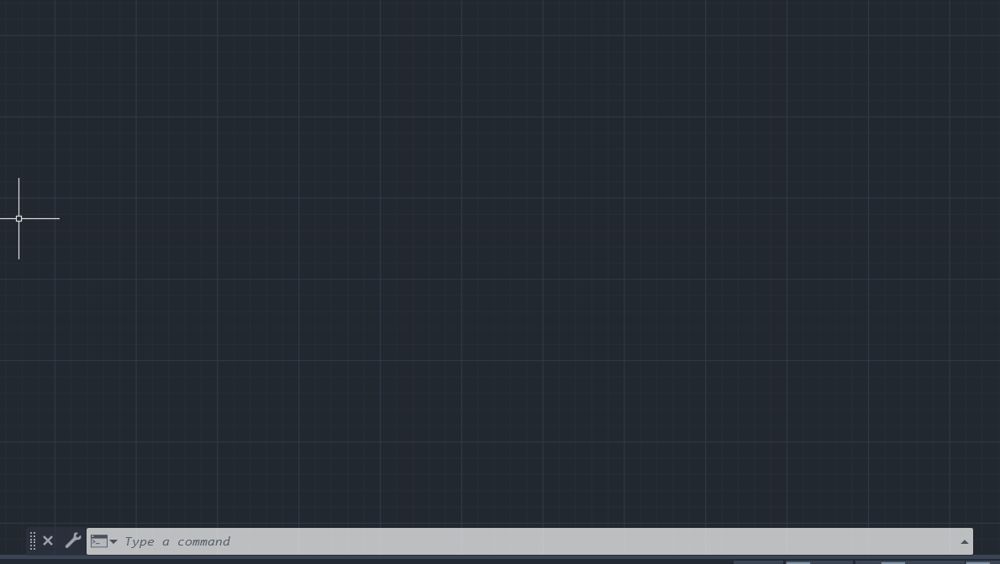

# PromptCad



## Overview

PromptCad is a custom AutoCAD plugin powered by large language models (LLMs) to automate manual CAD drawing tasks through natural language prompts. The system includes a backend API, an admin panel for management, and a plugin that connects directly with AutoCAD.

## Features

-   Automate CAD drawing tasks in AutoCAD using prompt-based commands.
-   Backend API for managing prompt workflows, user authentication, and configuration.
-   AdminPanel for managing users, API keys, and monitoring usage.
-   AutoCAD plugin for seamless integration and real-time interaction.
-   Secure storage of sensitive data and API keys.
-   MongoDB integration for persistent storage of prompts, users, and settings.

### Backend API

1. **Install Python**  
   Ensure Python 3.8 or higher is installed.

2. **Install dependencies**  
   Navigate to the `PromptCad.API` directory and run:

    ```
    pip install -r requirements.txt
    ```

3. **Set up environment variables**  
   Create a `.env` file in the `PromptCad.API` directory with the following content:

    ```
    MONGODB_URI=mongodb://localhost:27017
    MONGODB_DB=promptcad_db
    JWT_SECRET=your-secret-key
    JWT_ALGORITHM=HS256
    GEMINI_API_KEY=your-gemini-api-key
    ADMIN_EMAIL=admin@example.com
    ADMIN_PASSWORD=admin123
    ```

4. **Run the backend server**  
   Activate the virtual environment and start the server:
    ```
    .\env\Scripts\Activate.ps1
    uvicorn main:app --reload
    ```

### AdminPanel and Plugin

1. Open Visual Studio and load the `PromptCad.sln` solution.
2. Configure the `globalAPI.cs` files in both `PromptCad.AdminPanel` and `PromptCad.Plugin` projects with the appropriate API URL.
3. Run the solution to start the AdminPanel and Plugin.
